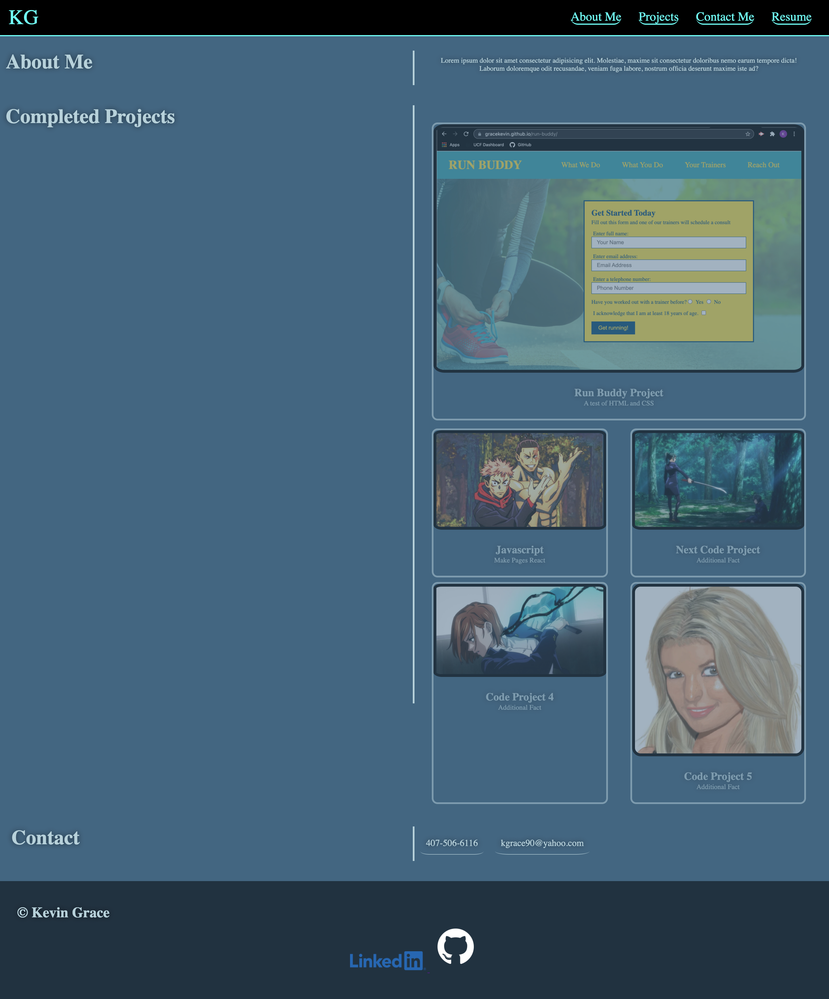

# KGPortfolio

This is the submission README file for the Module 2 Advanced CSS Challenge for UCF Boot Camp.

# The link to the page:
[gracekevin.github.io/KGPortfolio](https://gracekevin.github.io/KGPortfolio/)

The current render of my portfolio submission has taken a lot of effort to put together. There are a great many small details that are playing into the look and feel. i am not 100% satisfied with what i have at this point, but am continuing to work on it.

## Here is what the site will look like once loaded to a browser

